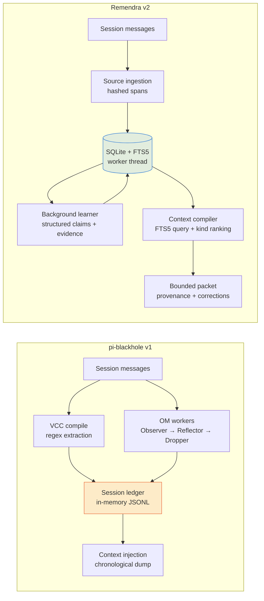
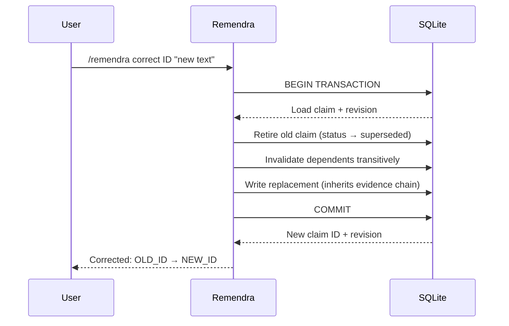

# Remendra for Pi

**Remember. Amend. Continue.**

Evidence-backed memory for [Pi](https://github.com/AerinWorks/pi): durable decisions, precise corrections, scoped recall, and bounded context.

Built against **Pi 0.85.1** · **Node 24** · **v2.0.0-alpha.2**

---

## Why Remendra

Pi-blackhole merged deterministic VCC compaction with session-ledger observational memory. Remendra replaces that v1 architecture with a SQLite-backed v2 engine. The legacy engine remains available at `dist/legacy.js` for rollback.

### What changed from pi-blackhole

| | pi-blackhole v1 | Remendra v2 |
|---|---|---|
| Storage | In-memory session ledger (JSONL) | SQLite + FTS5 in a worker thread |
| Persistence | Session-only — lost on switch/branch/compact | Cross-session, cross-branch |
| Retrieval | Regex + BM25 over live entries | FTS5 full-text search, scoped by lineage/project/user |
| Compilation | Chronological dump with VCC section headers | Query-matched, kind-priority-ranked, budget-bounded |
| Corrections | None — wrong observations stay until dropped | Transactional: supersede → invalidate dependents → replace |
| Evidence | Free-form LLM text | Source spans with SHA-256 content hashes |
| Scope | Session-only | Lineage (default), project (explicit promotion), user (opt-in) |
| Procedures | None | 2-trial validation gate per environment |
| Embeddings | None | Optional OpenAI-compatible semantic search |

### Architecture



v1 terminates at a session-scoped ledger — nothing survives a session switch. v2 writes claims and sources to SQLite with FTS5 indexing.

### Correction flow (v2 only)



v1 has no correction system. A wrong observation stays in the ledger until it is dropped or the session compacts.

## Smoke tests and performance

A synthetic benchmark suite is included as a development tool:

```
node benchmarks/suite.mjs    # 5-dimension smoke test
pnpm benchmark:v2            # per-claim compilation latency
```

These are smoke tests that verify the engine functions, not competitive benchmarks. The suite seeds synthetic claims into SQLite and measures compilation latency, FTS5 retrieval, cross-session persistence, and budget utilization. It does not run the v1 engine or any competing system.

**Per-claim microbenchmark** (1 000 synthetic claims, warm cache, single process):

```
p50: 16 ms    p95: 16 ms    database: 2.5 MB
```

Not a production SLA. Real-world performance depends on corpus size, query complexity, and provider latency for background learning.

## Known limits

This is alpha software. The project's own [validation document](docs/VALIDATION-V2.md) is the honest accounting of what has been tested and what has not.

**Not yet validated:** live-provider extraction quality, Windows/macOS, multi-day workloads, realistic large corpora, concurrent active sessions, power-loss fault testing, billing reconciliation accuracy, rate-limit behavior under sustained load.

**Not exact:** the token counter uses `ceil(UTF-8 bytes / 3)`, a deliberate heuristic that underreports real tokenizer counts by 20–39% median (measured against 698 real sessions). The [token rework plan](work_docs/plan-00-overview.md) documents the path to truthful counting.

**Not exhaustive:** lexical candidates capped at 600, historical scans at 2 000, anchors at 300, returned hits at 200. Omissions are visible in the response; the system does not claim perfect recall.

**Automatic learning defaults to lineage scope.** Newly extracted claims are visible only in the current session lineage. Cross-session availability requires explicit `/remendra promote ID project`. The system does not magically carry all memories into every new session.

**Test coverage:** 1 572 tests across the full repository (97 files). The focused v2 test suite is 64 tests across 5 files. The remaining tests cover the inherited VCC pipeline, OM system, config, commands, and vendored Pi base.

## Install

```bash
pi install git:github.com/yoda-digital/pi-remendra
```

Run `/reload` in Pi, then `/remendra doctor` and `/remendra help`.

Do not load pi-blackhole and Remendra together. Use `pi list` to find and remove the old package first. The v1 ledger and v2 database are separate; migration is explicit and leaves old files untouched.

For a development checkout:

```bash
pnpm install --frozen-lockfile
pnpm build
pi install /absolute/path/to/pi-remendra
```

## What works

- **Durable typed memory** — facts, decisions, constraints, preferences, hypotheses, procedures, and commitments, with revision history and exact source spans.
- **Corrections that propagate** — replacing a memory retires the old version, invalidates dependent conclusions, and prevents background extraction from reviving retired evidence.
- **Scope isolation** — current lineage by default, explicit project promotion, and opt-in user memory. Project identity survives a directory move through an explicit link.
- **Multilingual recall** — Unicode-preserving FTS5 search, exact IDs, source search, historical lookup, original transcript expansion, file drill-down, and touched-file history.
- **Bounded context** — whole-record selection with provenance, coverage gaps, conflicts, and omission counts. The complete rendered packet is measured before insertion.
- **Background learning** — source chunks have durable leases; successful claims and coverage commit together. Foreground work cancels extraction. Retry and daily reservation limits apply before dispatch.
- **Kind-priority ranking** — constraints and decisions rank above facts and hypotheses in context compilation.
- **Optional semantic search** — index memories at an OpenAI-compatible embedding endpoint. Revision and scope checks apply to every result.
- **Procedure validation** — candidate procedures need two distinct successful tool-result trials in the same environment before automatic retrieval.
- **User controls** — inspect, correct, pin, hide, retract, accept, promote, erase, export, import, backup, and diagnose.
- **Migration** — direct v1 observation/reflection import preserves distinct records, including Cyrillic content and old ID aliases.

## Quick start

```text
/remendra remember {"kind":"constraint","text":"Never run a production migration without a backup."}
/remendra search production
/remendra why MEMORY_ID
/remendra correct MEMORY_ID {"text":"Create and verify a backup before every production migration."}
/remendra pin MEMORY_ID
/remendra promote MEMORY_ID project
```

## Automatic learning and cost

Learning runs after `agent_settled`: at most 4 batches per settled run, 2 attempts per batch. Default daily budget: **80 000 memory tokens**. Use `/remendra budget` to inspect.

```text
/remendra settings {"observer":false}     # pause learning, keep recall
/remendra settings {"mode":"shadow"}      # compile without injecting
```

## Recall

Modes: `memory`, `history`, `source`, `regex`, `file`, `touched`.

```text
/remendra-recall PostgreSQL
/remendra-recall MEMORY_ID
/remendra-recall #12
/remendra-recall #12:src/config.ts
```

## Configuration

Default storage: `~/.pi/agent/pi-remendra/v2/`. Override with `PI_REMENDRA_HOME`.

```text
/remendra settings       # view config
/remendra gaps           # unprocessed source ranges
/remendra doctor         # SQLite integrity check
```

## Development

```bash
pnpm build && pnpm typecheck && pnpm lint && pnpm test
pnpm benchmark:v2                    # per-claim latency
node benchmarks/suite.mjs            # smoke test suite
```

[Engineering notes](docs/V2.md) · [Validation results](docs/VALIDATION-V2.md) · [Legacy docs](docs/LEGACY-README.md)

## License

MIT. Derived from [Pi Blackhole](https://github.com/k0valik/pi-blackhole). Attribution preserved in changelog and license.
